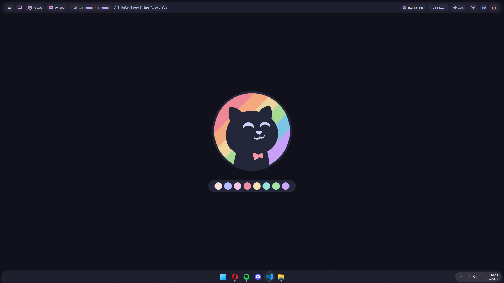
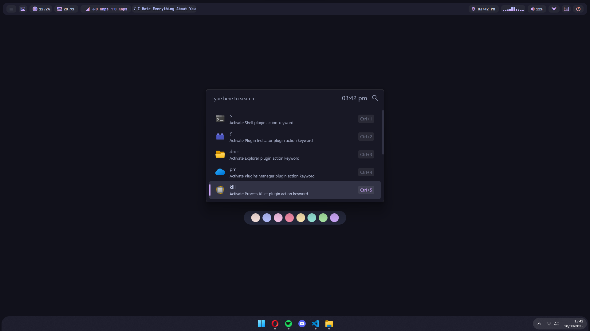
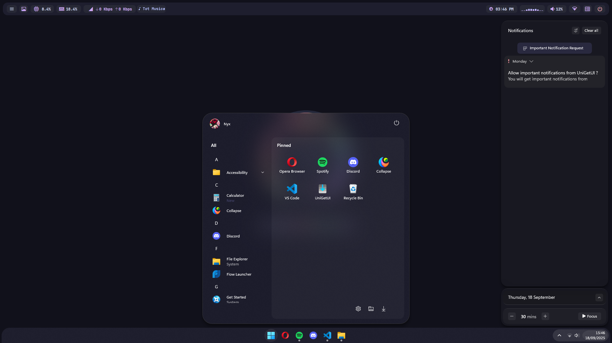
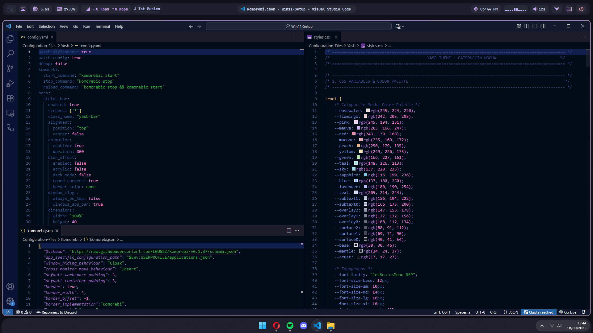
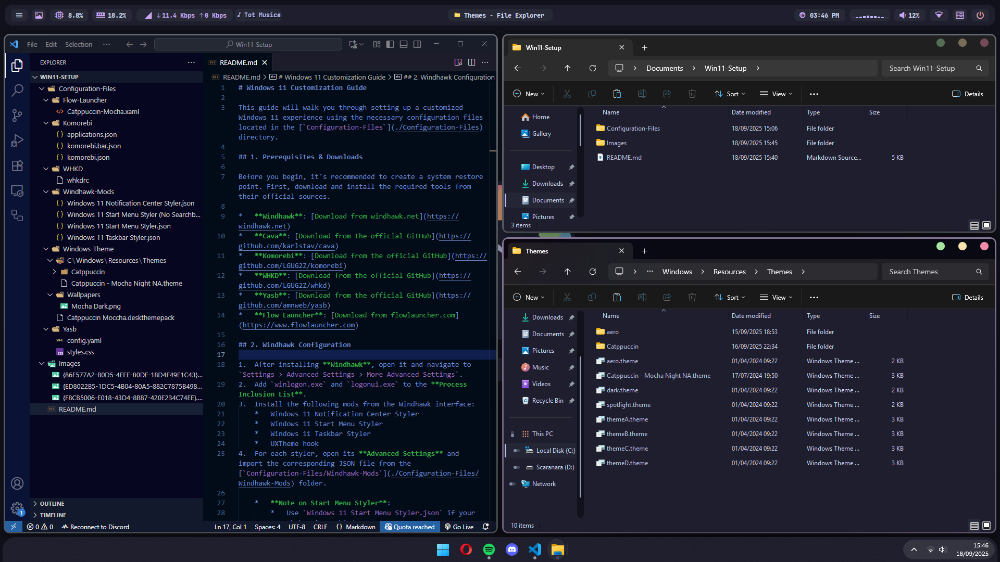

# Windows 11 Customization Guide

This guide will walk you through setting up a customized Windows 11 experience using the necessary configuration files located in the [`Configuration-Files`](./Configuration-Files) directory.

<details>
  <summary><b>Win11-Setup Previews</b></summary>

    
    
    
    
  

</details>

## 1. Prerequisites & Downloads

Before you begin, it's recommended to create a system restore point. First, download and install the required tools from their official sources.

*   **Windhawk**: [Download from windhawk.net](https://windhawk.net)
*   **Cava**: [Download from the official GitHub](https://github.com/karlstav/cava)
*   **Komorebi**: [Download from the official GitHub](https://github.com/LGUG2Z/komorebi)
*   **WHKD**: [Download from the official GitHub](https://github.com/LGUG2Z/whkd)
*   **Yasb**: [Download from the official GitHub](https://github.com/amnweb/yasb)
*   **Flow Launcher**: [Download from flowlauncher.com](https://www.flowlauncher.com)

## 2. Windhawk Configuration

1.  After installing **Windhawk**, open it and navigate to `Settings > Advanced Settings > More Advanced Settings`.
2.  Add `winlogon.exe` and `logonui.exe` to the **Process Inclusion List**.
3.  Install the following mods from the Windhawk interface:
    *   Windows 11 Notification Center Styler
    *   Windows 11 Start Menu Styler
    *   Windows 11 Taskbar Styler
    *   UXTheme hook
4.  For each styler, open its **Advanced Settings** and import the corresponding JSON file from the [`Configuration-Files/Windhawk-Mods`](./Configuration-Files/Windhawk-Mods) folder.

    *   **Note on Start Menu Styler**:
        *   Use `Windows 11 Start Menu Styler.json` if your search bar is enabled.
        *   Use `Windows 11 Start Menu Styler (No Searchbar).json` if you have disabled the search bar via Group Policy  
            (`User Configuration > Administrative Templates > Windows Components > Search > Fully Disable Search UI`).  
            If you can't find this policy, right-click `Administrative Templates`, select `Filter Options`, and set `Managed` to `"Any"`.

## 3. Komorebi & WHKD Setup

1.  Copy the files from [`Komorebi`](./Configuration-Files/Komorebi) directly into your user's home directory (`%USERPROFILE%`).
2.  Create a `.config` folder in your home directory if it doesn't already exist (`%USERPROFILE%/.config`).
3.  Copy the [`Yasb`](./Configuration-Files/Yasb) folder and the WHKD file from the [`WHKD`](./Configuration-Files/WHKD) folder into the `.config` directory.
4.  **Important**: Open the configuration files you just copied and replace all instances of "**Nyx**" inside config.yaml file with your current Windows username.
5.  Open PowerShell and run the following command to enable autostart for Komorebi and whkd:
    ```powershell
    komorebic enable-autostart --whkd
    ```
6.  Start Komorebi with this command:
    ```powershell
    komorebi start --whkd
    ```
    *   **Troubleshooting**: If the bar doesn't appear, try `komorebi start --whkd --bar`. If that works, use `komorebic stop` and then try the original `komorebi start --whkd` command again.

## 4. Yasb - Yet Another Status Bar

1.  With Yasb running, find its icon in the system tray.
2.  Right-click the tray icon and select **Enable Autostart**.

## 5. Flow Launcher Customization

1.  After installing **Flow Launcher**, open its settings from the system tray icon.
2.  Under the **General** tab, check the box for **Start Flow on system startup**.
3.  Go to the **Appearance** tab and click the **Open Theme Folder** button at the very bottom.
4.  Copy the `Catppuccin-Mocha.xaml` file from [`Flow-Launcher`](./Configuration-Files/Flow-Launcher) into the folder that opens.
5.  Restart Flow Launcher. You can now select the "Catppuccin Mocha" theme from the dropdown menu.

## 6. Custom Cursors

1.  Download the "Windows 11 Cursors Concept" from the [official DeviantArt page](https://www.deviantart.com/jepricreations/art/Windows-11-Cursors-Concept-886489356).
2.  Extract the downloaded files, right-click on the `install.inf` file, and select **Install**.
3.  Open Windows Settings and go to `Bluetooth & devices > Mouse > Additional mouse settings`.
4.  In the **Pointers** tab, select the new cursor scheme from the dropdown menu and click **Apply**.

## 7. Windows Theme and Wallpaper

1.  Paste the contents of the [`Themes`](Configuration-Files/Windows-Theme/C/Windows/Resources/Themes) to `C:\Windows/Resources/Themes` | [`Catppuccin theme by niivu`](https://www.deviantart.com/niivu/art/Catppuccin-for-Windows-11-1076249390)
2.  Adjust Wallpapers, Cursors and Accent colors as you like
3.  Create a `Wallpapers` folder inside your user's `Pictures` directory (`%USERPROFILE%\Pictures`).
4.  Copy the `Mocha-Dark.png` from [`Windows-Theme/Wallpapers`](./Configuration-Files/Windows-Theme/Wallpapers) into the new `Wallpapers` folder.  

    `Optional`
3.  Navigate to [`Windows-Theme`](./Configuration-Files/Windows-Theme) and double-click the `Catppuccin-Moccha.deskthemepack` file to install and apply the theme.